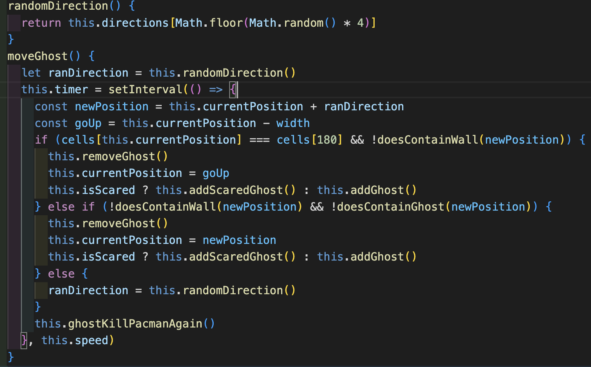

# Project 1 - PAC-MAN

<h2>Description</h2>

Pac-Man is an action video game where the player controls Pac-Man, who has to eat all dots found in a maze to win the game, while not getting caught by four ghosts. However, the player can eat a total of 4 enlarged dots, which scares the ghosts and turns them blue. This gives Pac-Man the ability to eat the ghosts for a certain time. Once all dots are collected, the game ends. 

This project was written in HTML, CSS, and JavaScript and was successfully completed within one week. 

 
<h2>Deployment link</h2>

This project was deployed on GitHub and can be found <a href="https://a-ullmann.github.io/PACMAN/"> here</a>.

 
<h2>Getting Started/Code Installation</h2>

The code can be found on <a href="https://github.com/a-ullmann/PACMAN"> my personal GitHub page</a>.

 
<h2>Timeframe & Working Team</h2>

This project was created by myself and completed within one week (7 days).

 
<h2>Technologies Used</h2>

<h4>HTML:</h4>
<ul>
  <li>Overlay for a welcoming starting page as well as a game over page</li>
  <li>Start, finish and restart buttons </li>
  <li>Audio elements for background music and game sound effects</li>
  <li>Images for buttons, as well as in-game life counter</li>
  <li>Set the structure for creating a grid with JavaScript</li>
</ul>

<h4>CSS:</h4>
<ul>
  <li>Flex-box for a flexible page</li>
  <li>CSS displays for the overlays</li>
  <li>Dynamic game over overlay, changing the text to “you win” if the player wins the game</li>
</ul>

<h4>JavaScript:</h4>
<ul>
  <li>Created a class for ghosts and extended Pac-Man</li>
  <li>setTimeout for when the player eats an enlarged dot and the ghosts get scared </li>
  <li>setInterval for ghost movement</li>
  <li>Using classList to add and remove specific classes</li>
  <li>addEventlisteners to listen for keystrokes to move Pac-Man with keydown, as well as clicks for the start/restart and play/pause buttons</li>
  <li>forEach method to target multiple ghosts</li>
</ul>

<h4>Other:</h4>
<ul>
  <li>Excalidraw.com to draw initial ideas and wireframe</li>
  <li>Github to deploy the project</li>
</ul>

 
<h2>Brief</h2>

<h4>Requirements</h4>
<ul>
  <li>The player should be able to clear at least one board</li>
  <li>The player's score should be displayed at the end of the game</li>
</ul>

<h4>Suggested enhancements</h4>
<ul>
  <li>Responsive design</li>
  <li>Each board gets more difficult</li>
  <li>Persistent leaderboard using `localStorage`</li>
</ul>

<h4>Challenges</h4>

The biggest challenge here is the logic which moves the ghosts. While their movement may appear random, they are always moving toward Pac Man, who is himself being moved by the player.

 
<h2>Planning</h2>

It was a challenge to plan for my first project as I had no previous experience. My ambitions were much greater than my abilities were at the time. Using Excalidraw, I first made a wireframe of the HTML layout, trying to define each div that I thought I would need. While doing so, I also thought of the sound effects which I wanted to add. Next up was CSS, where I started thinking about the images and the way Pac-Man would eat the dots. At first, I was considering putting and centering a div inside each div, but the better solution was to simply use an image that consisted of a yellow dot and a black background. I then defined my MVP by listing the most important functions and pseudocode them. The first important functionality was to get Pac-Man to move. This consisted of several functions that, when put together, would allow the player to use the arrow keys on their keyboard to control Pac-Man. 

 
<h2>Build/Code Process</h2>

Day 1: 
I completed a thorough plan of action consisting of an overview for HTML, CSS, JavaScript
HTML & CSS: creating a base grid layout for the playing field.
JS: pseudocode the most important functions, such as starting the game, movements, collisions, score point system

Day 2: 
I finalised the map by sketching it out in Excel and defining each cell. 

I successfully implemented ghost movement as well as collision detection for Pac-Man and ghosts by checking the ghosts next possible moves and then using if-statements to force them out of their spawn box. 

Day 3: 
I optimised ghost movement by giving it the ability to choose a random direction when colliding with a wall, as the following code shows:

Additionally, I added dots, including sound, for pac-man to eat by giving each div a background image.

Day 4: 
I cleaned up parts of my code, and created classes to make it more dynamic. By doing so I was able to add all ghosts successfully. 
The following screenshot shows the “Character” class. This class is mainly used for the ghosts, but it is also extended to serve as a basis for Pac-Man.

Day 5: 
I implemented a flexible overlay for the start of the game and game over to improve the user experience. 

I also added a score counter. This would update everytime Pac-Mac moved to a new cell.

Some challenges included getting the ghosts scared when pacman eats a cookie, as well as getting the ghosts to consistently move out of their spawn box. I also added multiple sound effects to keep the game engaging.

 
<h2>Challenges</h2>

Getting the ghosts movement correctly, especially when using classes and targeting multiple objects. Ghosts move by listening to a timer with a setInterval function, and having a random direction when colliding with a wall. It then goes through an if statement checking whether the next move is possible. If it is, it removes the ghost from the current position, then checks if the ghost is scared or not. Depending on this, it will add either a scared ghost or a normal ghost to the next position.

Once this was working, my next challenge was to implement proper wall collision. I did this by defining each div that I wanted to be a wall as an array. 

By doing this, I was able to make use of a forEach function inside my createEnvironment function to add a class name of “wall” to each div as defined above. 

This further allowed me to create a function that checks if the next position of ghosts contains a wall, returning a boolean:

 
<h2>Wins</h2>

Solving problems, such as Pac-Man appearing on the other side of the maze when moving out of it. Due to the grid system, I had to create two fake walls on either side so Pac-Man would not collide with anything. I was also very proud of getting the ghosts to move as expected. 

 
<h2>Key Learnings/Takeaways</h2>

As this was my first project, I learned a lot, especially getting used to the tools such as VSCode and inspecting elements directly in the browser. It was also very interesting to see how my initial planning developed. It felt difficult to plan in the beginning and my intuition was to just get started with the code itself. I later realised how important it is to set up a proper plan that I can follow. Furthermore, I learned a plethora of JavaScript methods, how to use functions properly, eventListeners, extended classes and tying key learnings together to create one functioning product.

 
<h2>Bugs</h2>

When the game finishes, sometimes the player has to press the start button twice for the game to restart. 
At times, it is possible to clip through the ghosts, letting the player stay alive.

 
<h2>Future Improvements</h2>

Add a while-loop to the random direction function for ghosts in order to decide their next movement quicker if they collide with a wall. Currently, they have to hit the correct direction, which could sometimes bring them to a stop in a corner.

Adding @media methods in the CSS to enable smartphone playability.

Animate characters to have a smooth movement. 
Add automatic movement for Pac-Man to resemble the original game. 
Create multiple levels. Once the player has finished the first level, they would move on to a new level, perhaps with faster moving ghosts.

